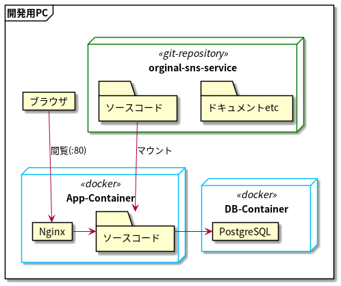

## システム概要
SNSの基本的な機能を備えたWebサービスです。  
PythonのDjangoで動作します。


## サーバー構成図
DBサーバー用とアプリケーションサーバー用の2つのDockerコンテナで構成されます  
※Dockerの事前インストールが必要



## Installation
* 以下コマンドを実行
```
# ソース取得
git clone git@github.com:kawaji-r/original-sns-service
# データベースコンテナ作成
bash original-sns-service/docker/1_database/build.sh
# アプリケーションコンテナ作成
bash original-sns-service/docker/2_app/build.sh
```
* `http://localhost`にアクセスするとログインページが表示されます

## Attention
* !実際に運用する場合はDjangoのSecret Keyを変更すること!
